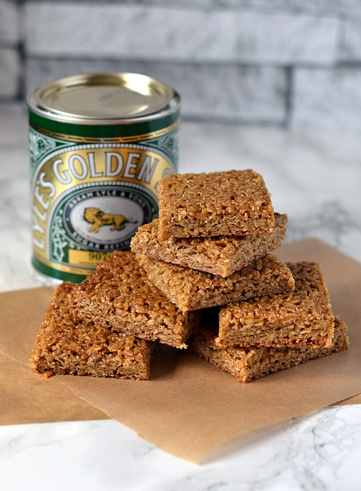

**Flapjacks are always fun; you can spruce them up however you like! For this recipe, I implore you to get creative; whether you add chocolate chunks, cinnamon, or raisins, make these flapjacks your own!**

## Ingredients 

 175g butter

175g golden syrup

175g light muscovado sugar

350g porridge oats

## Method 

**STEP 1**

Preheat the oven to 150C/130C Fan and line a 20cm/8in a square tin with baking paper.

**STEP 2**

Melt the butter in a medium pan over low heat. Brush the baking tin with a little bit of butter. Add the golden syrup and sugar to the butter and heat gently. Once the sugar is dissolved, and the butter is melted, remove the pan from the heat and stir in the porridge oats and any other ingredient or spice you like!

**STEP 3**

Pack the mixture into the tin and squash it down. Bake in the oven for 40 minutes.

**STEP 4**

Once baked, remove from the oven, leave to cool for 15 minutes, then turn out onto a chopping board and cut into squares.

**STEP 5**

These flapjacks are delicious in a packed lunch or as a grab-and-go breakfast.