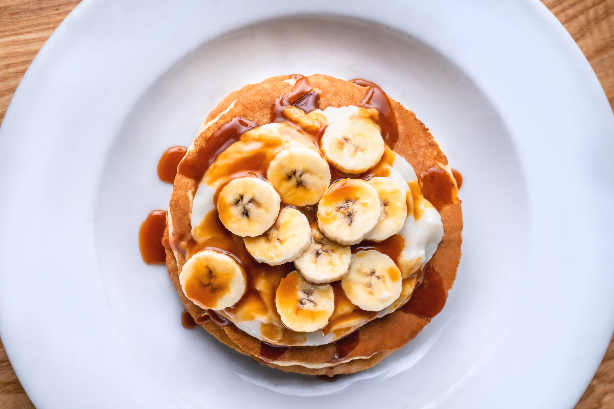

These super easy pancakes are a great way to treat your friends the morning after a party!

## Ingredients

100g plain flour 

2 large eggs 

300ml milk 

1 tbsp sunflower or vegetable oil, plus a little extra for frying 

Whatever topping you desire! 

These super easy pancakes are a great way to treat your friends the morning after a party!

## **Method**

**STEP 1**

Put 100g plain flour, 2 large eggs, 300 ml milk, 1 tbsp sunflower or vegetable oil and a pinch of salt
into a bowl or large jug, then whisk to a smooth batter. Then set aside for 30 mins to rest.

**STEP 2**

Set a medium frying pan over medium heat and carefully wipe it with some oiled kitchen paper.

**STEP 3**

When hot, cook your pancakes for 1 min on each side until golden, keeping them warm in the oven
as you go.

**STEP 4**

Serve with your favourite topping (or whatever is in the cupboard!). Once cold, you can layer the
pancakes between baking parchment, then wrap them in cling film and freeze them for up to 2
months.